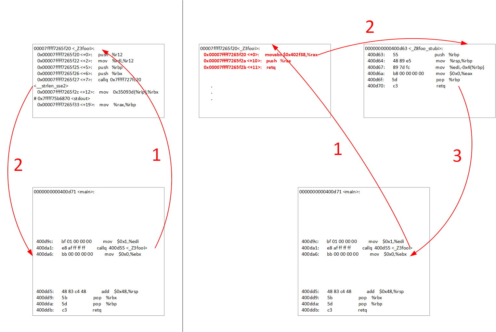

[中文](README_zh.md)|[English](README.md)

# Principle
## Two core points
- How to get the original function address (**addr_pri.h**, **addr_any.h**)
- How to replace the original function with stub function (**stub.h**)

## Supported
- Supported operating systems  : windows,linux,MacOS(x86-64, printf '\x07' | dd of=test_function bs=1 seek=160 count=1 conv=notrunc)
- Supported hardware platform  : x86,x86-64,arm64,arm32,arm thumb,mips64,riscv32,riscv64,loongarch64
- Supported compiler           : msvc,gcc,clang
- Support function type
  * [x] normal function
  * [x] variadic function
  * [x] template function
  * [x] overload function
  * [x] lambda
  * [x] static function(use addr_any.h)
  * [x] inline function(use compiler options)
  * [x] constructor function
  * [x] destructor function
  * [x] member function
  * [x] static member function
  * [x] virtual function(not pure)
  * [x] virtual and overload function
  * [x] functor
  * [x] private member function(use addr_pri.h)


## Inline Hook




- x86/x64


- aarch32/aarch64


- mips64

- riscv 


# Description of the unit test
## Cannot stub
- Can't stub the exit function, the compiler has made special optimizations.
- Can't stub pure virtual functions, pure virtual functions not have the address.
- Can't stub lambda functions, lambda functions not get the address.(You can try to use addr_any.h api.)
- Can't stub static functions, static function address is not visible.(You can try to use addr_any.h api.)


## Unit test compilation option for linux g++
- -fno-access-control
- -fno-inline
- -Wno-pmf-conversions
- -Wl,--allow-multiple-definition
- -no-pie -fno-stack-protector
- -fprofile-arcs
- -ftest-coverage

## Code coverage statistics for linux g++
```
lcov -d build/ -z
lcov -d build/ -b ../../src1 --no-external -rc lcov_branch_coverage=1 -t ut -c -o ut_1.info
lcov -d build/ -b ../../src2 --no-external -rc lcov_branch_coverage=1 -t ut -c -o ut_2.info
lcov -a ut_1.info -a ut_2.info -o ut.info
genhtml -o report/ --prefix=`pwd` --branch-coverage --function-coverage ut.info
```
## Code coverage statistics for windows

 [OpenCppCoverage](https://github.com/OpenCppCoverage/OpenCppCoverage)
```
OpenCppCoverage.exe --sources MySourcePath* -- YourProgram.exe arg1 arg2
```
# Interface description

## stub.h
```
Stub stub
stub.set(addr, addr_stub)
stub.reset(addr)
```

## addr_pri.h
```
Declaration:
    ACCESS_PRIVATE_FIELD(ClassName, TypeName, FieldName)
    ACCESS_PRIVATE_FUN(ClassName, TypeName, FunName)
    ACCESS_PRIVATE_STATIC_FIELD(ClassName, TypeName, FieldName)
    ACCESS_PRIVATE_STATIC_FUN(ClassName, TypeName, FunName)

Use:
    access_private_field::ClassNameFieldName(object);
    access_private_static_field::ClassName::ClassNameFieldName();
    call_private_fun::ClassNameFunName(object,parameters...);
    call_private_static_fun::ClassName::ClassNameFunName(parameters...);
    get_private_fun::ClassNameFunName();
    get_private_static_fun::ClassName::ClassNameFunName();
```

## addr_any.h(linux)
```
AddrAny any //for exe
AddrAny any(libname) //for lib

int get_local_func_addr_symtab(std::string func_name_regex_str, std::map<std::string,void*>& result)
int get_global_func_addr_symtab(std::string func_name_regex_str, std::map<std::string,void*>& result)
int get_weak_func_addr_symtab(std::string func_name_regex_str, std::map<std::string,void*>& result)

int get_global_func_addr_dynsym( std::string func_name_regex_str, std::map<std::string,void*>& result)
int get_weak_func_addr_dynsym(std::string func_name_regex_str, std::map<std::string,void*>& result)

```
## addr_any.h(windows)
```
AddrAny any //for all
int get_func_addr(std::string func_name, std::map<std::string,void*>& result)
```
## addr_any.h(darwin)
```
not implement
```

