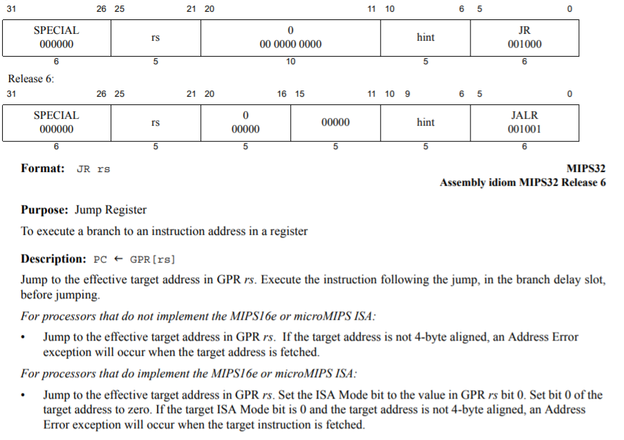

[中文](README_zh.md)|[English](README.md)


# 原理介绍
## 两个核心点
- 如何获取原函数的地址(**addr_pri.h**、**addr_any.h**)
- 如何用桩函数替换原函数(**stub.h**)

## 支持情况
- 支持的操作系统 : windows,linux，MacOS(x86-64, printf '\x07' | dd of=test_function bs=1 seek=160 count=1 conv=notrunc)
- 支持的硬件平台 : x86,x86-64,arm64,arm32,arm thumb,mips64,riscv32,riscv64,loongarch64
- 支持的编译器 : msvc,gcc,clang
- 支持函数类型：
  * [x] 常规函数
  * [x] 可变参函数
  * [x] 模板函数
  * [x] 重载函数
  * [x] lambda函数
  * [x] 静态函数(使用 addr_any.h)
  * [x] 内联函数(通过编译选项)
  * [x] 类的构造函数
  * [x] 类的析构函数
  * [x] 类的成员函数
  * [x] 类的静态成员函数
  * [x] 类的成员虚函数(非纯虚函数)
  * [x] 类的虚函数并且重载
  * [x] 仿函数
  * [x] 类的私有成员函数(使用 addr_pri.h)

  

## Inline Hook


- x86/x64 跳转指令

- aarch32/aarch64 跳转指令


- mips64 跳转指令

- riscv 跳转指令


# 单元测试相关说明
## 不能打桩
- 不能对 exit 函数打桩,编译器做优化了
- 不能对纯虚函数打桩, 纯虚函数没有地址
- 不能对 lambda 函数打桩, lambda 函数获取不到地址(但可以尝试使用 addr_any.h 接口获取地址)
- 不能对静态函数打桩, 静态函数地址不可见.(但可以尝试使用 addr_any.h 接口获取地址)


## 单元测试编译选项, linux g++可用的
- -fno-access-control
- -fno-inline
- -Wno-pmf-conversions
- -Wl,--allow-multiple-definition
- -no-pie -fno-stack-protector
- -fprofile-arcs
- -ftest-coverage


## 代码覆盖率, linux g++使用方法
```
lcov -d build/ -z
lcov -d build/ -b ../../src1 --no-external -rc lcov_branch_coverage=1 -t ut -c -o ut_1.info
lcov -d build/ -b ../../src2 --no-external -rc lcov_branch_coverage=1 -t ut -c -o ut_2.info
lcov -a ut_1.info -a ut_2.info -o ut.info
genhtml -o report/ --prefix=`pwd` --branch-coverage --function-coverage ut.info
```
## 代码覆盖率, Windows使用方法
 [OpenCppCoverage](https://github.com/OpenCppCoverage/OpenCppCoverage)
```
OpenCppCoverage.exe --sources MySourcePath* -- YourProgram.exe arg1 arg2
```

# 接口介绍

## stub.h
```
Stub stub
stub.set(addr, addr_stub)
stub.reset(addr)
```

## addr_pri.h
```
Declaration:
    ACCESS_PRIVATE_FIELD(ClassName, TypeName, FieldName)
    ACCESS_PRIVATE_FUN(ClassName, TypeName, FunName)
    ACCESS_PRIVATE_STATIC_FIELD(ClassName, TypeName, FieldName)
    ACCESS_PRIVATE_STATIC_FUN(ClassName, TypeName, FunName)

Use:
    access_private_field::ClassNameFieldName(object);
    access_private_static_field::ClassName::ClassNameFieldName();
    call_private_fun::ClassNameFunName(object,parameters...);
    call_private_static_fun::ClassName::ClassNameFunName(parameters...);
    get_private_fun::ClassNameFunName();
    get_private_static_fun::ClassName::ClassNameFunName();
```

## addr_any.h(linux)
```
AddrAny any //for exe
AddrAny any(libname) //for lib

int get_local_func_addr_symtab(std::string func_name_regex_str, std::map<std::string,void*>& result)
int get_global_func_addr_symtab(std::string func_name_regex_str, std::map<std::string,void*>& result)
int get_weak_func_addr_symtab(std::string func_name_regex_str, std::map<std::string,void*>& result)

int get_global_func_addr_dynsym( std::string func_name_regex_str, std::map<std::string,void*>& result)
int get_weak_func_addr_dynsym(std::string func_name_regex_str, std::map<std::string,void*>& result)

```
## addr_any.h(windows)
```
AddrAny any //for all
int get_func_addr(std::string func_name, std::map<std::string,void*>& result)
```
## addr_any.h(darwin)
```
没实现
```


